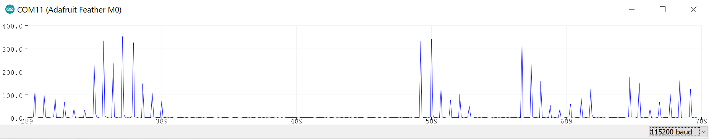

# Microphone
### [Adafruit Silicon MEMS Microphone Breakout - SPW2430](https://www.adafruit.com/product/2716)

## Pin connections

| Mic Pin | MCU Pin |
| --- | --- |
| Vin | 3V |
| Gnd | Gnd |
| DC | Analog Pin (e.g. A0) |

## Exercise

Open and upload [mic_amplitude](mic_amplitude) to the Arduino. This sketch reads the microphone connected to pin A0 and reports the peak-to-peak distance (i.e. "loudness").

Code to note:
- `int sampleWindow = 50`: The time window to collect readings from the mic every loop (in ms). 50ms roughly equates to 20Hz sample rate.
- `Serial.begin(115200)`: The serial port's baud rate is set to 115200, be sure to change the serial monitor / processing sketch accordingly.
- `millis()`: This function returns the amount of time that has passed since MCU reset.

Example serial plotter screenshot:

Things to consider:
- How would you smooth the serial values? (Instead of spikes, how do you have a line chart that ramps up and down smoothly?)
- Is the mic omnidirectional or is it biased? 
- How would you physically change the way that it picks up sound?